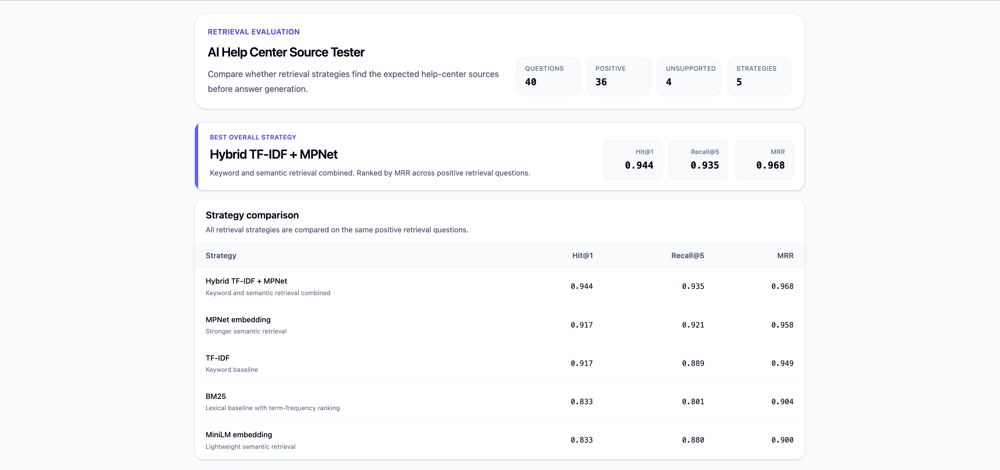

# AI Help Center Source Tester

A retrieval evaluation workbench for testing whether a help-center assistant finds the right source documents before answer generation.

The project compares multiple retrieval strategies against a controlled fake SaaS help center. It measures whether each strategy retrieves the expected source documents, where it fails and which type of questions are harder to retrieve correctly.

Live demo: https://support-rag-source-eval.netlify.app/



*Overview of the retrieval evaluation dashboard comparing keyword, embedding and hybrid retrieval strategies.*

## Why

Help-center AI assistants can produce confident answers while being grounded in the wrong or incomplete source documents. Looking only at the final answer can hide the retrieval problem.

This project focuses on the retrieval step before answer generation.

The goal is to answer questions like:

* Did the retrieval system find the expected source article?
* Did the correct source appear at rank 1 or further down the list?
* Which strategy works best for exact keyword questions, semantic paraphrases or multi-intent support questions?
* Which categories and question types are more likely to fail?

## What this project tests

The evaluation uses:

* synthetic SaaS help-center documentation
* realistic support/customer questions
* expected source documents for each question
* retrieval outputs from several strategies
* ranking metrics and diagnostic breakdowns

The dashboard shows:

* best overall retrieval strategy
* strategy comparison by Hit@1, Recall@5 and MRR
* diagnostic breakdown by category, slice and difficulty
* question-level inspection of expected vs retrieved sources

## Fake product context

The dataset uses a fake SaaS product called **ExampleOps**. The help-center docs are synthetic but structured like realistic SaaS support documentation.

The docs cover:

* billing and invoices
* cancellation and refunds
* failed payments
* workspace access
* entitlement sync
* plan limits and upgrades
* dashboard exports
* export and billing permissions

See [`docs/dataset-notes.md`](docs/dataset-notes.md) for more detail on the dataset design.

## Evaluation dataset

The current dataset contains:

| Type                                       | Count |
| ------------------------------------------ | ----: |
| Total test questions                       |    40 |
| Positive retrieval questions               |    36 |
| Unsupported / no-confident-match questions |     4 |

Positive retrieval questions have expected source documents and are included in the ranking metrics.

Unsupported questions are included in the dataset to represent cases where the assistant should not confidently retrieve a source but they are not included in the ranking metrics yet.

## Retrieval strategies

The project currently compares five retrieval strategies:

| Strategy                 | Description                                                              |
| ------------------------ | ------------------------------------------------------------------------ |
| `bm25`                   | Lexical baseline using BM25 ranking                                      |
| `tfidf`                  | Keyword-based retrieval using TF-IDF and cosine similarity               |
| `embedding-minilm`       | Local semantic retrieval using `sentence-transformers/all-MiniLM-L6-v2`  |
| `embedding-mpnet`        | Local semantic retrieval using `sentence-transformers/all-mpnet-base-v2` |
| `hybrid-tfidf50-mpnet50` | 50/50 weighted hybrid of normalized TF-IDF and MPNet scores              |

## Evaluation metrics

Each strategy is evaluated using ranking metrics:

| Metric     | Meaning                                                   |
| ---------- | --------------------------------------------------------- |
| `Hit@1`    | Whether at least one expected source appears at rank 1    |
| `Hit@3`    | Whether at least one expected source appears in the top 3 |
| `Hit@5`    | Whether at least one expected source appears in the top 5 |
| `Recall@3` | How many expected source docs appear in the top 3         |
| `Recall@5` | How many expected source docs appear in the top 5         |
| `MRR`      | Mean reciprocal rank of the first correct source          |

Hit metrics show whether retrieval found at least one useful source.

Recall metrics show whether retrieval covered all expected sources.

MRR rewards strategies that rank the first correct source higher.

## Current results

Current evaluation over 36 positive retrieval questions:

| Strategy                 | Hit@1 | Recall@5 |   MRR |
| ------------------------ | ----: | -------: | ----: |
| `hybrid-tfidf50-mpnet50` | 0.944 |    0.935 | 0.968 |
| `embedding-mpnet`        | 0.917 |    0.921 | 0.958 |
| `tfidf`                  | 0.917 |    0.889 | 0.949 |
| `embedding-minilm`       | 0.833 |    0.880 | 0.900 |
| `bm25`                   | 0.833 |    0.801 | 0.904 |

The hybrid strategy performs best overall by MRR in the current dataset.

The diagnostic breakdown shows that different strategies perform better on different groups of questions. For example, exact keyword questions behave differently from vague or multi-intent questions.

## Main findings

### 1. Hybrid retrieval performs best overall

The 50/50 TF-IDF + MPNet hybrid has the strongest overall result in the current dataset. It combines lexical matching with semantic retrieval which helps when questions contain both exact product terms and paraphrased user language.

### 2. MPNet is the strongest single semantic baseline

`all-mpnet-base-v2` performs close to the hybrid strategy and is stronger than the smaller MiniLM embedding model on this dataset.

This makes it a useful semantic baseline when comparing whether a hybrid strategy is actually improving retrieval or only adding noise.

### 3. Keyword methods are still important for certain use cases

BM25 and TF-IDF perform well on questions with exact document language, product terms or clear keyword overlap.

They are weaker when the question is vague, indirect or combines multiple support intents.

### 4. Overall scores hide where retrieval fails

The dashboard groups results by:

* category
* slice
* difficulty

This makes it easier to inspect where retrieval is strong or weak instead of relying only on a single aggregate score.

## Repository overview

The project has two main parts:

- `scripts/` contains the retrieval and evaluation pipeline.
- `src/` contains the React dashboard for inspecting the results.
- `data/` contains the help-center docs, test questions and generated evaluation outputs.
- `docs/` contains dataset notes and screenshots.

## Source files

Inputs:

| File                         | Purpose                                                               |
| ---------------------------- | --------------------------------------------------------------------- |
| `data/docs/`                 | Fake help-center documentation                                        |
| `data/test-questions.json`   | Test questions with expected source documents and evaluation metadata |
| `data/failure-analysis.json` | Notes for selected retrieval failures                                 |

Script-generated outputs:

| File                                       | Purpose                                             |
| ------------------------------------------ | --------------------------------------------------- |
| `data/chunks.json`                         | Chunks generated from help-center docs              |
| `data/bm25-results.json`                   | BM25 retrieval output                               |
| `data/keyword-results.json`                | TF-IDF retrieval output                             |
| `data/embedding-results-minilm.json`       | MiniLM embedding retrieval output                   |
| `data/embedding-results-mpnet.json`        | MPNet embedding retrieval output                    |
| `data/hybrid-results-tfidf50-mpnet50.json` | Hybrid retrieval output                             |
| `data/eval-results.json`                   | Evaluation results across all strategies            |
| `src/generated/evaluation-data.ts`         | Generated typed data used by the frontend dashboard |

## Running the evaluation pipeline

Install Python dependencies:

```bash
uv sync
```

Run the full evaluation pipeline:

```bash
uv run python scripts/run_eval_pipeline.py
```

Generate the typed frontend data:

```bash
uv run python scripts/generate_frontend_evaluation_data.py
```

Run Python formatting and linting:

```bash
uv run ruff check .
uv run ruff format .
```

## Running the dashboard

Install frontend dependencies:

```bash
npm install
```

Run the local dev server:

```bash
npm run dev
```

Create a production build:

```bash
npm run build
```

Run frontend checks:

```bash
npm run lint
npm run format:check
```

Preview the production build:

```bash
npm run preview
```

## Notes

The current dataset is synthetic but the failure modes are based on realistic help-center and support-assistant problems: stale source ranking, incomplete source coverage, exact-keyword overmatching and semantic matches that are plausible but not sufficient.
